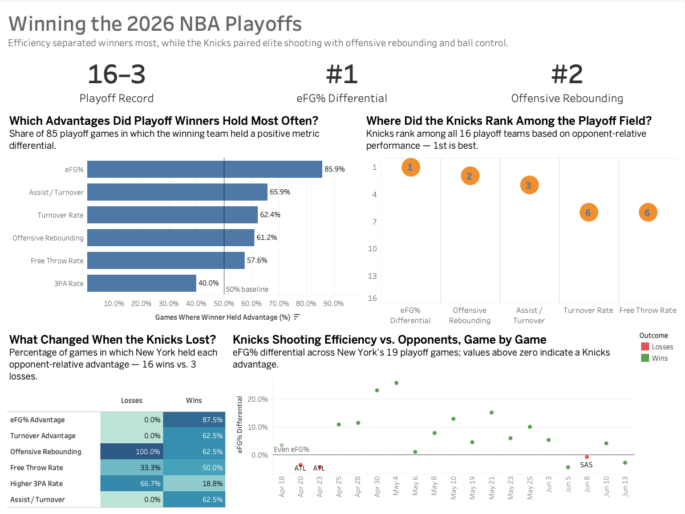

# Winning the 2026 NBA Playoffs

League-wide analysis of the game-level performance factors most strongly associated with winning in the 2026 NBA Playoffs, with the New York Knicks as a case study.

[View the interactive Tableau dashboard](https://public.tableau.com/views/nba_playoff_winning_factors/2026NBAPlayoffDashboard?:language=en-US&publish=yes&:sid=&:redirect=auth&:display_count=n&:origin=viz_share_link)



## Project Overview

This project analyzes all 85 games from the 2026 NBA Playoffs, from the first round through the NBA Finals, to identify which opponent-relative performance differences were most consistently associated with winning.

The analysis uses one team-game row per observation, producing 170 validated team-game records across 16 playoff teams.

After evaluating league-wide patterns, the New York Knicks are used as a case study to examine how their championship run aligned with the factors most strongly associated with winning.

## Analytical Question

Which game-level performance differences were most strongly associated with winning during the 2026 NBA Playoffs, and how did the New York Knicks perform in those areas during their championship run?

## Key Findings

- Winners held the effective field-goal percentage advantage in **85.9%** of playoff games, making shooting efficiency the most consistent separator among the six metrics analyzed.
- Assist-to-turnover advantage appeared in **65.9%** of wins, turnover-rate advantage in **62.4%**, offensive-rebounding advantage in **61.2%**, and free-throw-rate advantage in **57.6%**.
- Winners held the higher three-point-attempt rate in only **40.0%** of games, indicating that three-point volume alone was not consistently associated with winning.
- The Knicks ranked **1st** among all 16 playoff teams in average eFG% differential, **2nd** in offensive-rebound percentage differential, and **3rd** in assist-to-turnover differential.
- In all three Knicks losses, New York had a negative eFG% differential, negative turnover-rate advantage, and negative assist-to-turnover differential.
- The Knicks still held a positive offensive-rebounding differential in all three losses, suggesting that second-chance opportunities alone did not offset weaker shooting efficiency and possession control.

## Metrics

The analysis focuses on six game-level metrics:

- **Effective field-goal percentage:** `(FGM + 0.5 × 3PM) / FGA`
- **Turnover rate:** `TOV / (FGA + 0.44 × FTA + TOV)`
- **Offensive-rebound percentage:** `OREB / (OREB + Opponent DREB)`
- **Free-throw rate:** `FTA / FGA`
- **Three-point-attempt rate:** `3PA / FGA`
- **Assist-to-turnover ratio:** `AST / TOV`

Most analytical comparisons use opponent-relative differentials.

For example:

`eFG% differential = Team eFG% - Opponent eFG%`

Turnover-rate advantage is reversed so that positive values always represent better turnover performance:

`Turnover-rate advantage = Opponent TOV Rate - Team TOV Rate`

Three-point-attempt rate is treated as a shot-profile metric rather than a performance ranking because a higher attempt share is not inherently better.

## Data Pipeline

```text
NBA.com / nba_api
        ↓
Python data collection
        ↓
Data-quality validation
        ↓
PostgreSQL relational database
        ↓
SQL analytical views and opponent matching
        ↓
Pandas validation and analysis
        ↓
Tableau-ready datasets
        ↓
Tableau dashboard
```

## Data Validation

The final dataset contains:

- **85** playoff games
- **170** team-game rows
- **16** teams
- **85** wins and **85** losses
- **0** duplicate team-game records
- **0** missing analytical values

Validation checks include:

- exactly two teams per game
- exactly one winner and one loser per game
- winner points greater than loser points
- box-score arithmetic consistency
- points reconciliation
- home/away structure
- opponent plus-minus symmetry
- metric differential symmetry across every game

The final differential-symmetry validation returned:

`invalid_games = 0`

## Tech Stack

- Python
- Pandas
- Jupyter
- PostgreSQL
- SQL
- SQLAlchemy
- nba_api
- Matplotlib
- Tableau Public
- Git
- GitHub

## Project Files

- `src/` — data collection, database loading, and validation scripts
- `sql/` — schema, analytical views, and exploratory SQL
- `notebooks/` — source audit and Pandas analysis
- `data/processed/` — Tableau-ready datasets
- `tableau/` — packaged Tableau workbook
- `images/` — dashboard preview

## Tableau Dashboard

The final dashboard combines four views:

1. League-wide frequency of winner advantages
2. Knicks rankings among the playoff field
3. Knicks wins versus losses
4. Knicks game-by-game eFG% differential

[View the interactive Tableau dashboard](https://public.tableau.com/views/nba_playoff_winning_factors/2026NBAPlayoffDashboard?:language=en-US&publish=yes&:sid=&:redirect=auth&:display_count=n&:origin=viz_share_link)

## Limitations

This analysis identifies **associations rather than causal relationships**.

The project uses team box-score data and does not account for player-level, lineup, possession-level, or play-by-play effects.

The Knicks loss comparison is based on only three losses, so those averages should be interpreted cautiously.

Team playoff sample sizes differ because teams were eliminated at different stages of the postseason.

## Data Source

NBA team game logs were retrieved from NBA.com statistics endpoints using the community-maintained `nba_api` Python package.

The Play-In Tournament is excluded.

This is an independent, noncommercial educational project and is not affiliated with or endorsed by the National Basketball Association.
